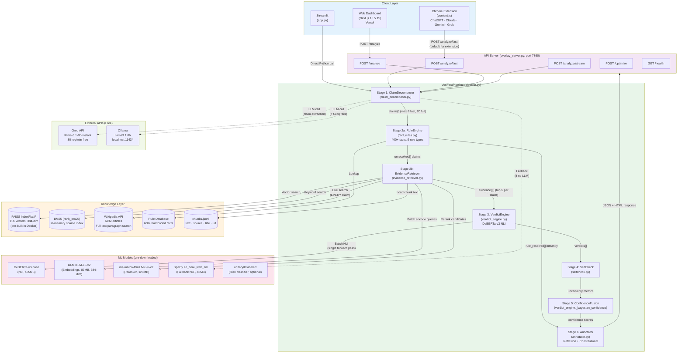
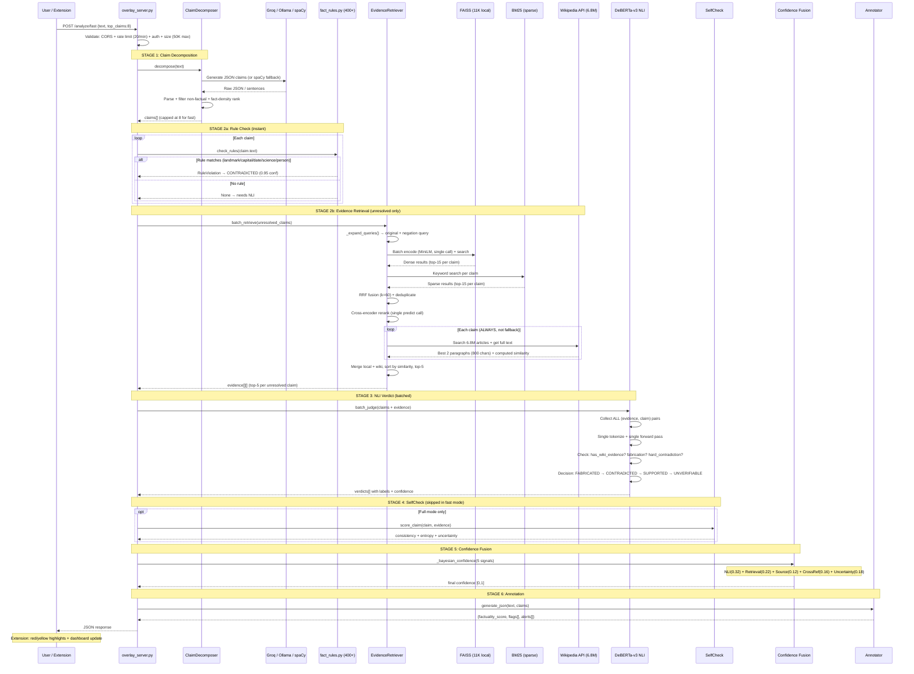
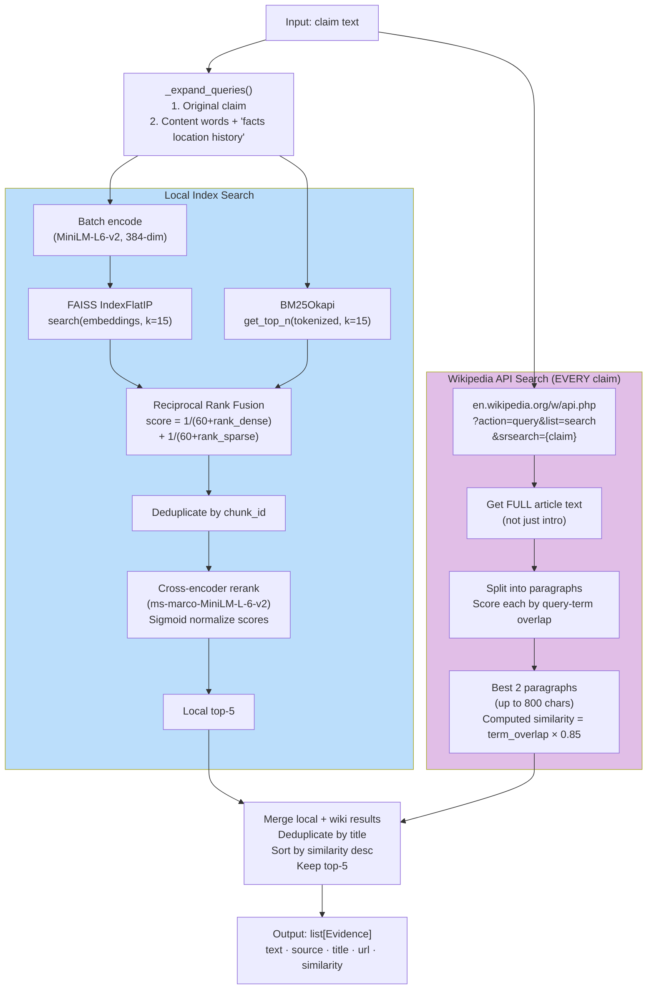
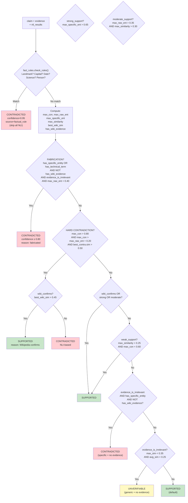
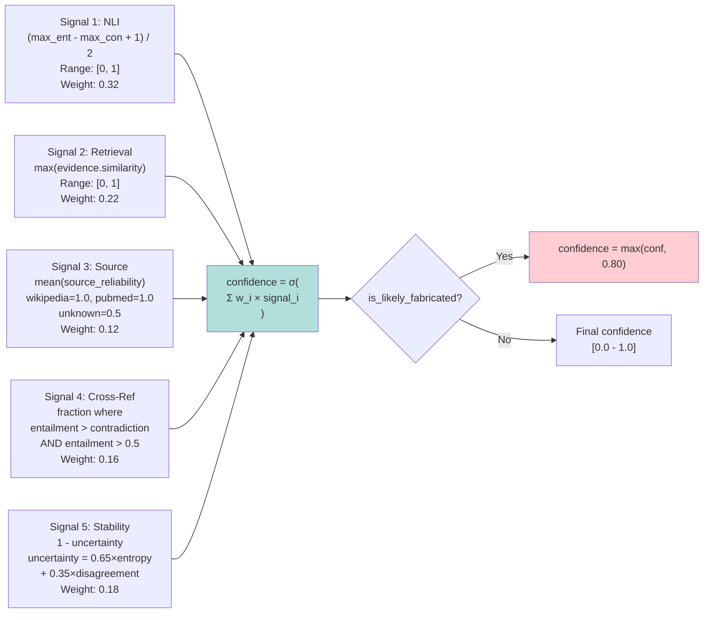
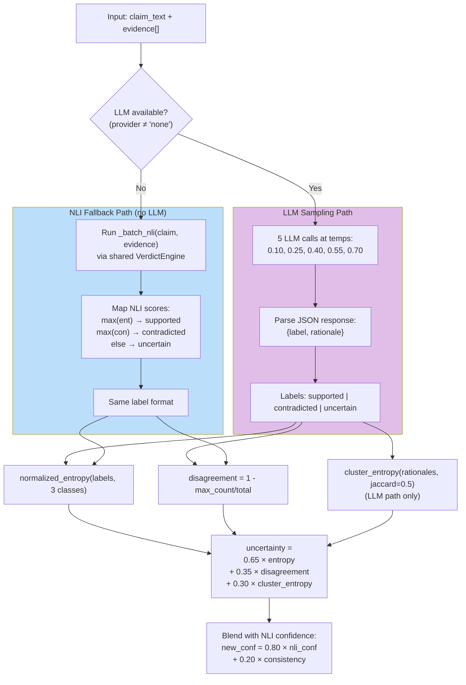
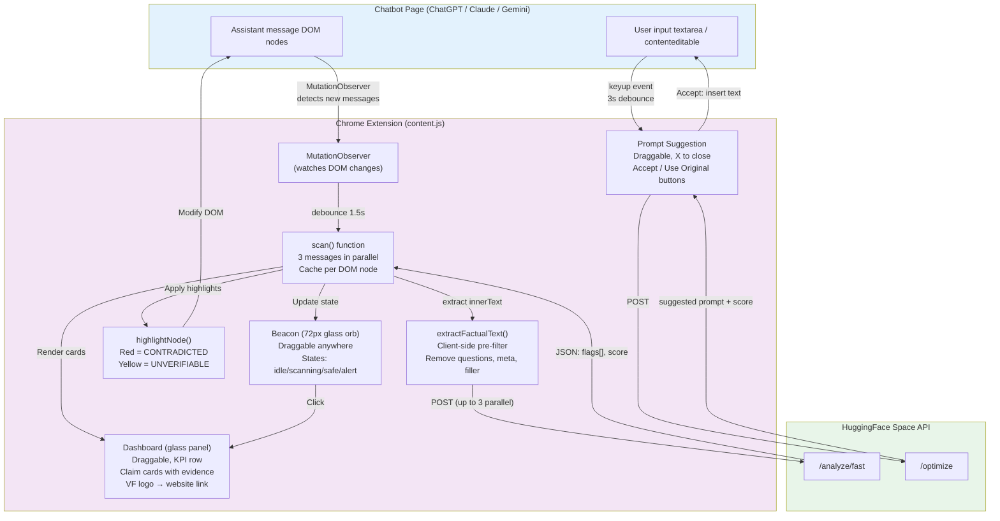
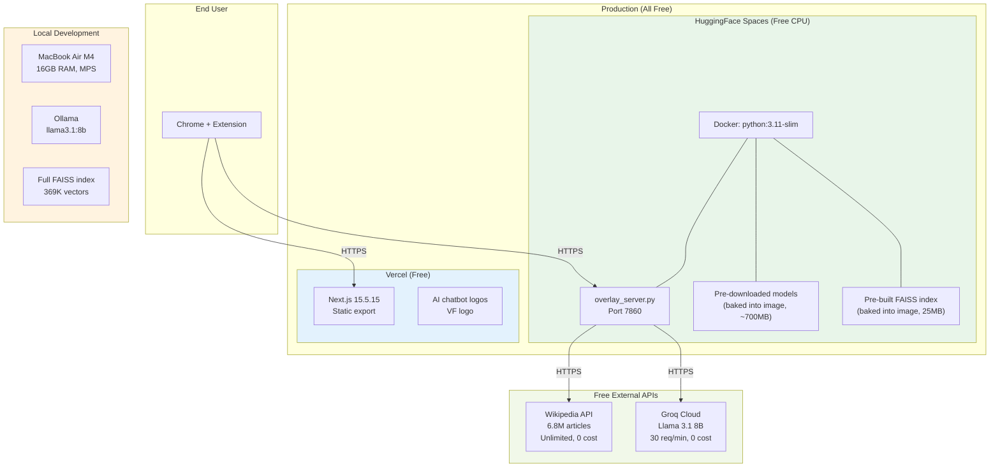
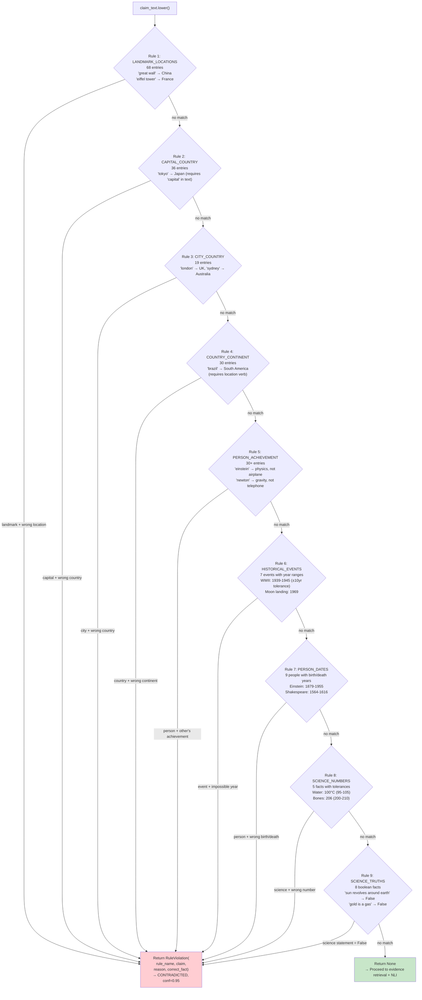
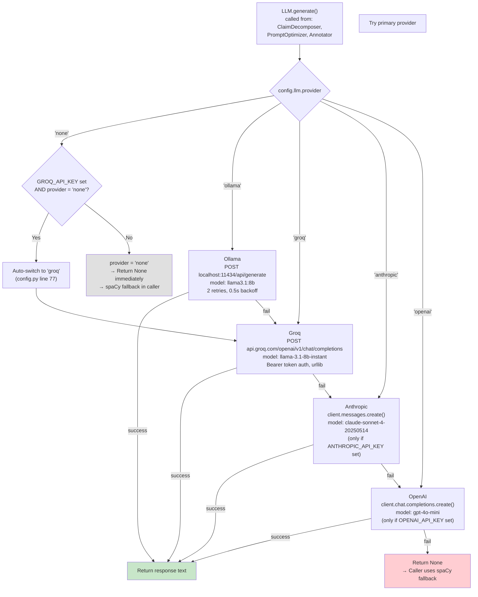

# VeriFACT AI — Architecture Diagrams (Verified Against Source Code)

> Every arrow and connection verified against actual Python source.
> Optimized for Claude Opus rendering. Paste into claude.ai for diagrams.

---

## 1. System Architecture

---

## 2. Complete Request-Response Flow

---

## 3. Evidence Retrieval Detail

---

## 4. Verdict Decision Tree (Exact Code Logic)

---

## 5. Bayesian Confidence Fusion (5 Signals)

---

## 6. SelfCheck (Two Paths)

---

## 7. Chrome Extension Architecture

---

## 8. Deployment Architecture

---

## 9. Rule Engine (9 Rule Types, Actual Execution Order)

---

## 10. LLM Provider Fallback Chain (Actual Code)

---

*All arrows verified against source code commit 3c282bd.*
*Every decision branch matches actual if/elif/else in Python.*
