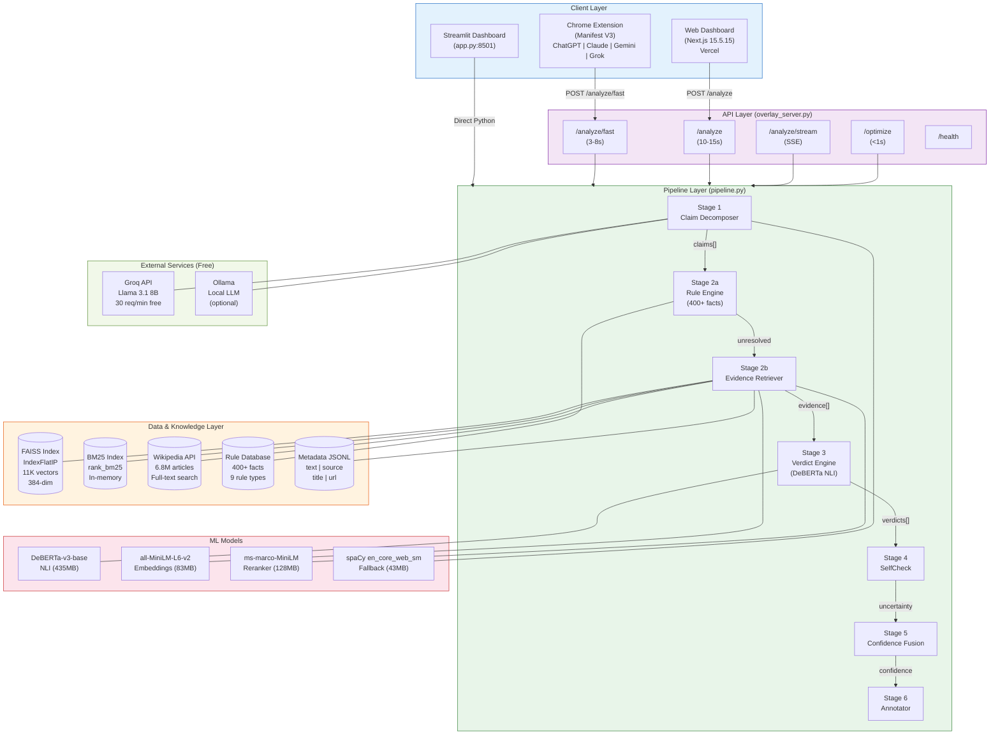
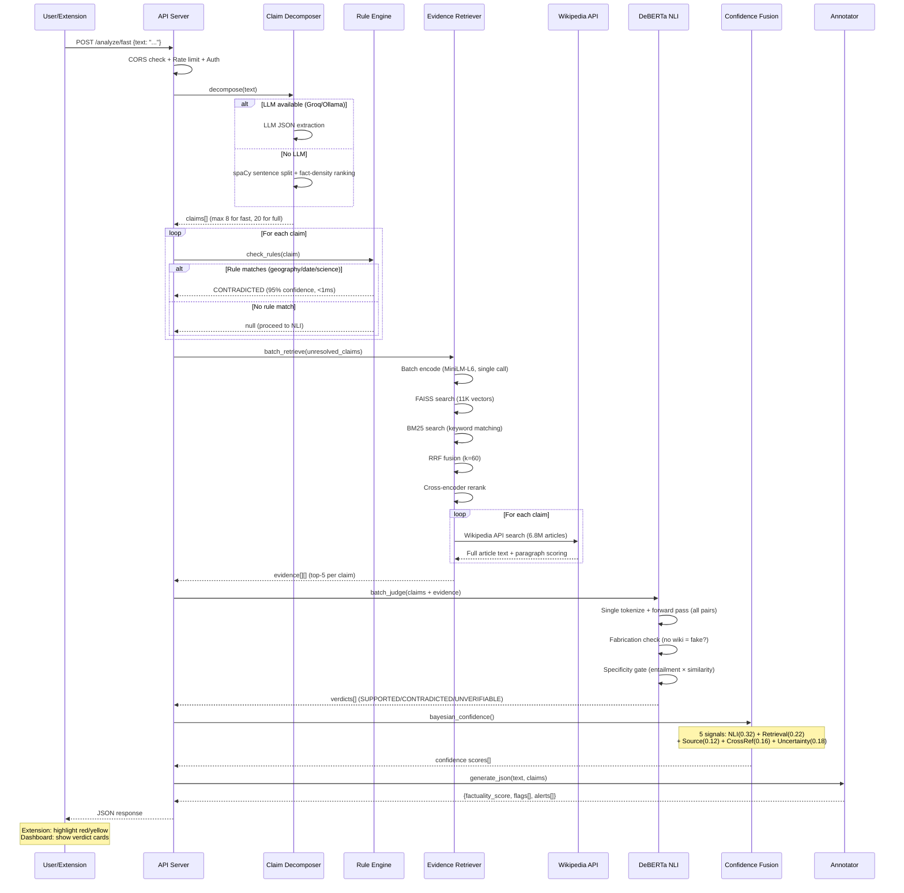
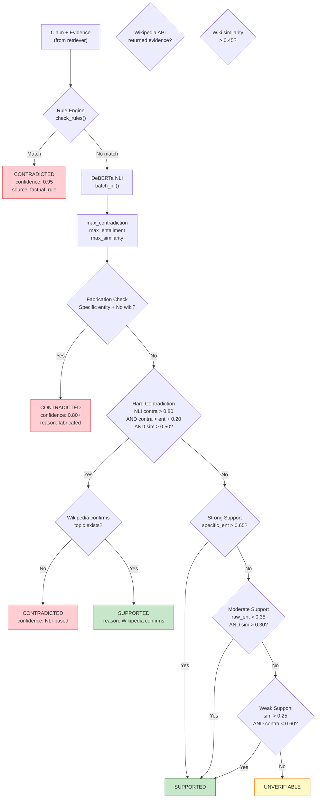
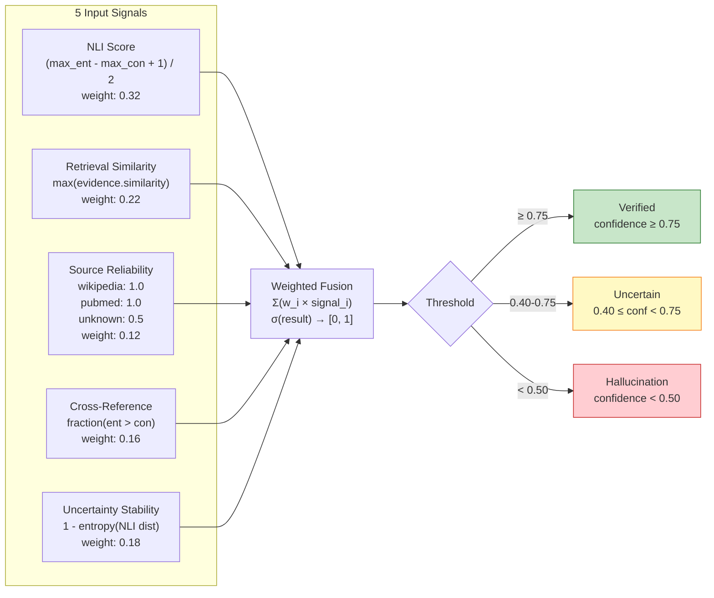
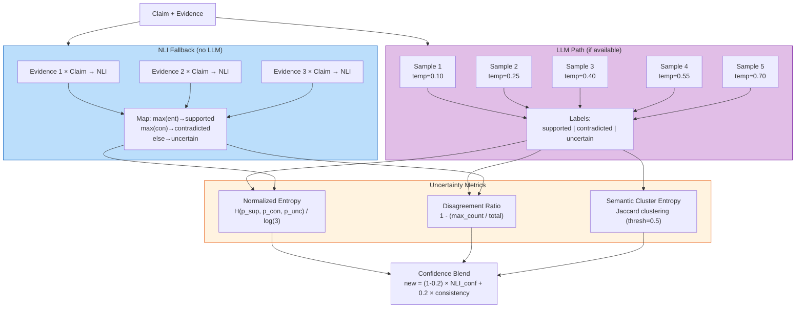
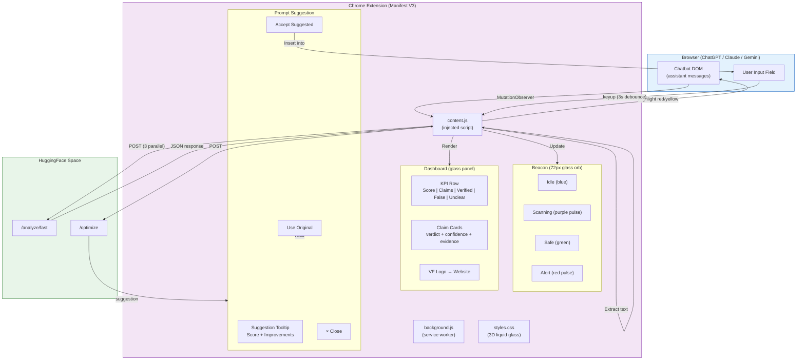
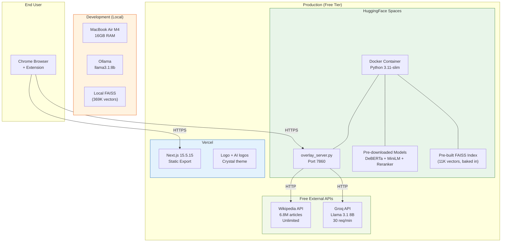
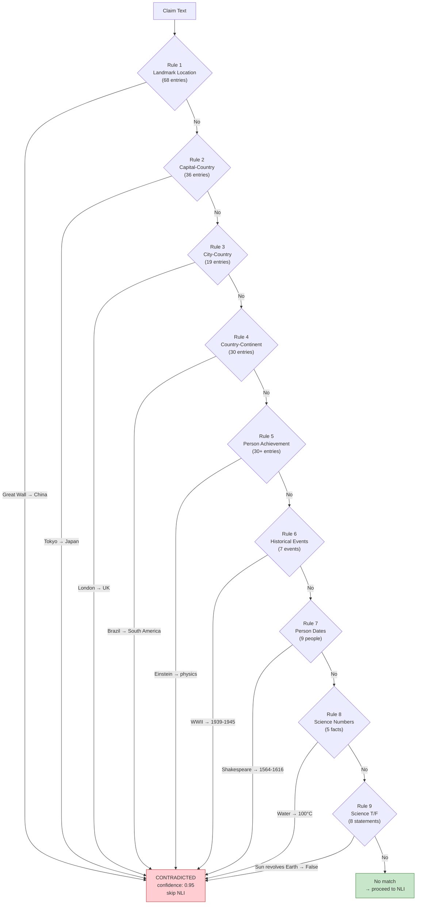
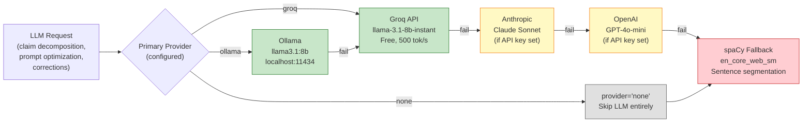

# VeriFACT AI — All Architecture & Flow Diagrams (Mermaid Code)

> Paste each code block into https://mermaid.live to render

---

## 1. System Architecture (High-Level)

---

## 2. Pipeline Data Flow (Request → Response)

---

## 3. Evidence Retrieval Pipeline (Hybrid Search)

```mermaid
graph LR
    CLAIM["Claim Text<br/>'Napoleon lost Waterloo in 1815'"]

    subgraph EXPAND["Query Expansion"]
        Q1["Original query"]
        Q2["Negation query<br/>(content words + 'facts location history')"]
    end

    subgraph DENSE["Dense Retrieval"]
        ENC["Encode<br/>(MiniLM-L6-v2<br/>384-dim)"]
        FAISS["FAISS IndexFlatIP<br/>search(query, k=15)"]
        DR["Dense Results<br/>(15 candidates)"]
    end

    subgraph SPARSE["Sparse Retrieval"]
        TOK["Tokenize<br/>(lowercase, split)"]
        BM25["BM25Okapi<br/>score(query)"]
        SR["Sparse Results<br/>(15 candidates)"]
    end

    subgraph FUSION["Reciprocal Rank Fusion"]
        RRF["RRF Score =<br/>1/(60+rank_dense) +<br/>1/(60+rank_sparse)"]
        DEDUP["Deduplicate<br/>by chunk_id"]
        FUSED["Fused Candidates<br/>(15 unique)"]
    end

    subgraph RERANK["Cross-Encoder Reranking"]
        CE["ms-marco-MiniLM-L-6<br/>predict(query, passage)"]
        SIG["Sigmoid normalization"]
        TOP["Top-5 reranked"]
    end

    subgraph WIKIAPI["Wikipedia API (6.8M articles)"]
        SEARCH["Search API<br/>srsearch=query"]
        FULL["Get full article text"]
        PARA["Score paragraphs by<br/>query term overlap"]
        BEST["Best 2 paragraphs<br/>(800 chars)"]
    end

    subgraph MERGE["Final Evidence"]
        MRG["Merge local + wiki<br/>Deduplicate by title<br/>Sort by similarity"]
        FINAL["Top-5 Evidence<br/>with source + URL"]
    end

    CLAIM --> EXPAND
    Q1 --> ENC
    Q2 --> ENC
    ENC --> FAISS
    FAISS --> DR

    Q1 --> TOK
    TOK --> BM25
    BM25 --> SR

    DR --> RRF
    SR --> RRF
    RRF --> DEDUP
    DEDUP --> FUSED
    FUSED --> CE
    CE --> SIG
    SIG --> TOP

    CLAIM --> SEARCH
    SEARCH --> FULL
    FULL --> PARA
    PARA --> BEST

    TOP --> MRG
    BEST --> MRG
    MRG --> FINAL

    style DENSE fill:#bbdefb,stroke:#1565c0
    style SPARSE fill:#ffe0b2,stroke:#e65100
    style FUSION fill:#c8e6c9,stroke:#2e7d32
    style RERANK fill:#f8bbd0,stroke:#c62828
    style WIKIAPI fill:#e1bee7,stroke:#7b1fa2
    style MERGE fill:#fff9c4,stroke:#f57f17
```

---

## 4. Verdict Engine Decision Tree

---

## 5. Bayesian Confidence Fusion

---

## 6. SelfCheck Consistency Scoring

---

## 7. Chrome Extension Architecture

---

## 8. Deployment Architecture

---

## 9. Rule Engine Coverage

---

## 10. LLM Fallback Chain

---

*All diagrams verified against codebase commit 3ec97e2 (April 17, 2026).*
*Paste each mermaid code block into https://mermaid.live to render.*
