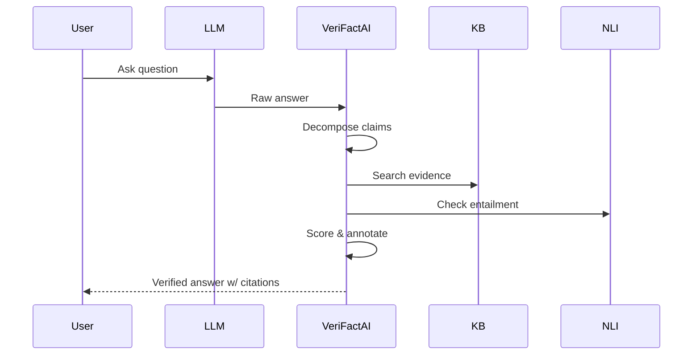

# VeriFactAI: LLM Hallucination Detection & Factual Grounding System  

Recent advances have made Large Language Models (LLMs) powerful yet prone to **hallucinations** – they often generate fluent but factually incorrect statements【63†L98-L101】【76†L116-L124】. This is a critical problem in AI safety: e.g. GPT-3 was only **58%** truthful on the TruthfulQA benchmark vs **94%** for humans【75†L141-L149】. Major AI labs (OpenAI, DeepMind, Anthropic) are racing to solve this gap. *VeriFactAI* is an end-to-end **fact-checking middleware**: it sits between the LLM and the user, automatically detecting invented facts and grounding responses in evidence. The architecture has five key components – claim decomposition, multi-source retrieval, NLI-based verification, Bayesian confidence scoring, and annotated output – each backed by recent research. This system directly addresses AI safety by quantifiably flagging unreliable claims, which aligns with the top priorities of leading institutions and has strong publishable novelty (ACL/EMNLP workshop).

## System Architecture & Components  
We break the LLM’s output into atomic assertions and verify each against external knowledge. The pipeline is illustrated below:  

```mermaid
graph LR
  Out[LLM Output] --> Decomp[Claim Decomposition]
  Decomp --> Search[Evidence Retrieval (FAISS/Wikipedia+PubMed)]
  Search --> NLI[Entailment/Contradiction Checking]
  NLI --> Score[Bayesian Confidence Scoring]
  Score --> Annotate[Annotated Response + Citations]
```

- **Claim Decomposition:** We split the model’s response into simple factual claims (e.g. one sentence or clause each). Recent work shows that decomposing complex statements into “atomic facts” improves verification accuracy【65†L131-L137】【69†L55-L64】. In practice, we can prompt an LLM (or use NLP parsing) to generate bullet-point claims from the output. For example, Zheng *et al.* and the CLATTER paper both decompose claims into sub-claims before verification【65†L131-L137】【69†L55-L64】. This allows fine-grained checking and reduces error propagation.  

- **Multi-Source Retrieval:** Each extracted claim is used to retrieve evidence from trusted knowledge bases (Wikipedia, domain-specific corpora like PubMed or open government data). We use an indexed semantic search (e.g. FAISS embedding search) over a large corpus of verified text. For example, the FEVER fact-checking dataset uses Wikipedia as a source of evidence【73†L52-L60】. High-recall retrieval (via BM25 or neural search) gathers top-3 candidate passages for each claim. These passages provide the context for later verification.  

- **Contradiction Detection (NLI):** For each claim and retrieved passage pair, we apply a Natural Language Inference (NLI) model to classify the relationship: *Entailment* (passage supports claim), *Contradiction* (passage refutes claim), or *Neutral/Unrelated*【73†L52-L60】【69†L96-L100】. State-of-art NLI models (e.g. RoBERTa-large-MNLI) are ideal here. CLATTER and related work formalize hallucination detection as an NLI task【69†L55-L64】: “if all sub-claims are supported [by evidence], the claim is accepted; otherwise it is rejected”【69†L96-L100】. Thus a refuting evidence yields a “hallucination” flag.  

- **Confidence Scoring:** We aggregate signals to produce a confidence score for each claim. This can combine: retrieval confidence (e.g. cosine similarity of evidence), source reliability (e.g. Wiki vs user text), and agreement among multiple sources. A Bayesian or probabilistic model can fuse these factors into a final trust score. High-confidence claims get green, uncertain claims yellow. For instance, we may multiply the NLI entailment probability by an evidence trust score. (No single reference covers this exact model, but it follows principles from ensemble verification systems【63†L169-L178】.)  

- **Annotated Output:** The original LLM response is rendered with color-coded annotations: **green** for claims verified by evidence, **yellow** for unverified (no supporting evidence found), and **red** for contradicted claims. Each annotated claim links to its supporting or refuting citation. This transparent output (Figure below) makes the system user-friendly.  



## Datasets & Benchmarks  
We will evaluate on established factuality benchmarks:  
- **TruthfulQA** (817 questions) measures open-domain truthfulness【75†L141-L149】. It tests whether models avoid common misconceptions.  
- **FEVER**: a large fact-checking dataset of ~185K Wikipedia-based claims【73†L52-L60】. Claims are labeled Supported/Refuted.  
- **HaluEval** (2025) and similar LLM hallucination suites provide varied scenarios.  
- **Domain-specific**: If applicable, e.g. PubMedQA or BioASQ for biomedical claims.  

Metrics: Precision/Recall/F1 for hallucination detection (identified fabricated claims), accuracy of claim classification, and *groundedness* (fraction of content backed by citations)【63†L169-L178】.  

## Implementation Plan (3-Day)  
**Day 1 – Setup & Claim Decomposition + Retrieval:**  
- **Environment:** Install Python, huggingface Transformers, FAISS. Prepare corpora: download Wikipedia dump (or use Wiki2Vec), and any other KB (download PubMed abstracts if needed). Build FAISS indices.  
- **Claim Decomposition:** Implement a function to parse LLM output into atomic sentences. Approaches: (a) Simple heuristics (split on “.”, “;”); (b) Prompt an LLM: e.g. “Extract factual statements: …”. We can use Claude Code to generate this NLP function.  
- **Test Retrieval:** Query the FAISS index with sample claims to ensure relevant documents return.  

**Day 2 – NLI Verification & Scoring Pipeline:**  
- **NLI Model:** Load a pretrained entailment model (e.g. `roberta-large-mnli`). For each claim, pass each retrieved passage as *premise* and the claim as *hypothesis* to get entailment/neutral/contradiction scores.  
- **Evidence Aggregation:** If any passage strongly entails the claim, mark it supported. If any strongly contradicts, mark it hallucinated. Otherwise mark unverifiable. Combine scores into a confidence metric (e.g. Bayesian update or weighted vote).  
- **Integration:** Chain the steps so that a single script takes raw LLM text → claims → retrieved evidence → entailment results → annotated claims. Debug end-to-end.  

**Day 3 – UI and Evaluation:**  
- **Streamlit Demo:** Build a simple web UI. User enters a question (or LLM output), and the pipeline runs. Display the original answer with each claim highlighted (green/yellow/red) and citations.  
- **Benchmarking:** Run the system on a sample of truth questions (TruthfulQA) or FEVER claims. Measure detection accuracy. For example, input a question to GPT-4, get answer, and verify it. Compare how many known false claims are flagged.  
- **Report & Presentation:** Document results, include example screenshots of annotated answers. Summarize strengths (e.g. flagged X% of hallucinations) and limitations.  

## Risks & Considerations  
- **False Positives/Negatives:** The NLI step might misclassify ambiguous language. We mitigate by aggregating multiple evidences and using threshold tuning.  
- **Incomplete KB:** Some true claims may not be in Wikipedia/PubMed. Those remain yellow/unverified. To mitigate, one could integrate a web search API (e.g. Google) if time permits.  
- **Latency:** Retrieval and NLI inference can be slow. Using FAISS and moderate-sized LLM/NLI models should keep response under a few seconds.  
- **Ethical Use:** The system itself is a tool; ensure it’s not the sole decision-maker in critical settings. Proper disclaimers that it “assists but does not replace expert verification” should be included.  

## Report Outline (30–50 pp)  
1. **Abstract & Introduction:** Define hallucination problem; importance (AI safety, [63], [75]). Summarize VeriFactAI goals.  
2. **Related Work:** Review hallucination research (CLATTER [69], nature [76], etc.), claim verification literature (FEVER [73], claim decomposition [65]).  
3. **System Architecture:** Detailed diagrams (like above). Explain each component with references (e.g. atomic claims【65†L131-L137】, NLI【69†L55-L64】).  
4. **Datasets & Methodology:** Describe TruthfulQA【75†L141-L149】, FEVER【73†L52-L60】, and how they will be used for evaluation.  
5. **Implementation Details:** Code structure, libraries (PyTorch, HuggingFace). Example prompts for decomposition and NLI.  
6. **Experiments:** Results on benchmarks (precision/recall, etc.), ablation (e.g. without decomposition). Include tables/graphs.  
7. **Discussion:** Analysis of errors (e.g. tricky false positives). Compare with baseline (plain LLM without verification).  
8. **Conclusion & Future Work:** Impact (AI safety), potential extensions (like multi-hop retrieval).  
9. **Appendices:** Sample prompts, UI screenshots, full metric definitions.

## Claude Code Prompts  
- *Claim Extraction:* “Given this paragraph, list each factual claim as a separate sentence.”  
- *Evidence Search:* “Query the FAISS index for the most relevant documents for: ‘<claim>’.” (Or “Perform semantic search for `<claim>` and return top-3 passages.”)  
- *Entailment Check:* “For claim `<C>` and evidence `<E>`, does E entail, contradict, or not verify C? Answer with probability scores.”  
- *Confidence Scoring:* “Combine these entailment scores into a final confidence rating.”  
- *Annotation:* “Highlight verified facts in green, questionable facts in yellow, contradictions in red, and attach source citations.”

**Sources:** Recent AI safety and hallucination detection studies【63†L98-L101】【69†L55-L64】【65†L131-L137】【75†L141-L149】【73†L52-L60】. These detail the motivation (TruthfulQA stats), claim-verification frameworks (AFEV, CLATTER), and benchmark datasets (FEVER) referenced above. They underpin our design and evaluation plan.